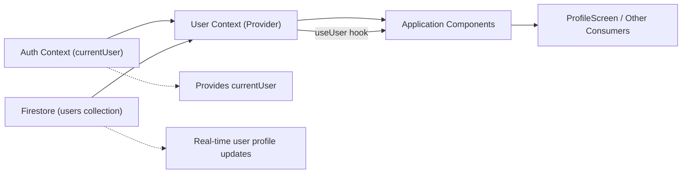

# User Context

## Overview
The **User Context** module manages and provides access to authenticated user profile data throughout the application. By subscribing to real-time updates in the user document in Firestore, this module supplies the latest user profile information to all components that require it, ensuring the app always displays up-to-date user data.

## Key Features

- **Centralized User Profile State**: Offers a single source of truth for the authenticated user's profile data, accessible from any part of the component tree.
- **Real-time Firestore Sync**: Listens for changes in the user's Firestore document and updates the context automatically, ensuring real-time reflections of profile changes.
- **Context-based Access**: Provides a React Context hook (`useUser`) so components can easily access user profile data without prop drilling or redundant fetching logic.

## System Errors

- **No User Found**: 
  - **Description**: If the user's Firestore document does not exist, a message `"No such user!"` is logged to the console.
  - **Resolution**: Ensure that the user is properly created and present in Firestore under the `users` collection after registration. Check Firestore permissions and document structure if this persists.

- **Authentication Not Available**:
  - **Description**: If the authentication context does not provide a `currentUser`, no Firestore listener is established.
  - **Resolution**: Ensure the application handles authentication before accessing user context. Authenticate users before providing access to this module.

## Usage Examples

```javascript
// Example: Consuming profile data in a component

import React from 'react';
import { View, Text } from 'react-native';
import { useUser } from '../context/UserContext';

export default function ProfileScreen() {
  const { profile } = useUser();

  return (
    <View>
      <Text>User Profile</Text>
      <Text>Name: {profile.name}</Text>
      <Text>Email: {profile.email}</Text>
    </View>
  );
}
```

## System Integration


