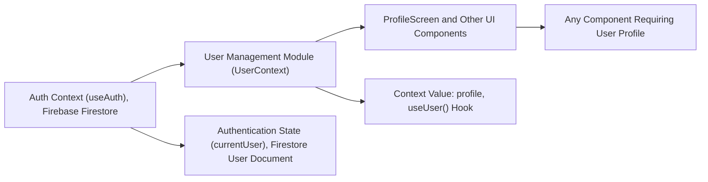

# User Management Module

## Overview
The User Management module provides centralized access to the authenticated user's profile data throughout the app. It leverages Firebase Firestore to automatically synchronize user profile updates, making user information readily available to all consuming components. This module plays a critical role by ensuring that user-specific context is consistent and up-to-date across the application.

## Key Features
- **User Profile Context**: Offers an application-wide context containing the current user's profile, accessible from any component.
- **Automatic Profile Sync**: Monitors and updates profile data in real-time via a live Firebase Firestore listener.
- **Simple Consumption Hook**: Exposes a `useUser()` hook that allows easy access to user profile data.
- **Integration with Authentication**: Ties user context to authentication state using the result of `useAuth()` (from AuthContext).

## System Errors
- **Profile Not Found**: If a user's profile document does not exist in Firestore, an informational message ("No such user!") is logged.  
  _Resolution_: Ensure each authenticated user has a corresponding document in the `users` collection.
- **No Authenticated User**: If authentication state is not set when trying to access profile data, the profile context remains empty.  
  _Resolution_: Ensure user is properly authenticated before relying on profile data.

## Usage Examples

```javascript
// Access user profile in any component
import React from "react";
import { Text, View } from "react-native";
import { useUser } from "../context/UserContext";

export default function ProfileScreen() {
  const { profile } = useUser();

  // Handle loading or missing profile cases as needed
  if (!profile.uid) return <Text>Loading...</Text>;

  return (
    <View>
      <Text>Welcome, {profile.displayName || "User"}!</Text>
      <Text>Email: {profile.email}</Text>
    </View>
  );
}
```

## System Integration


