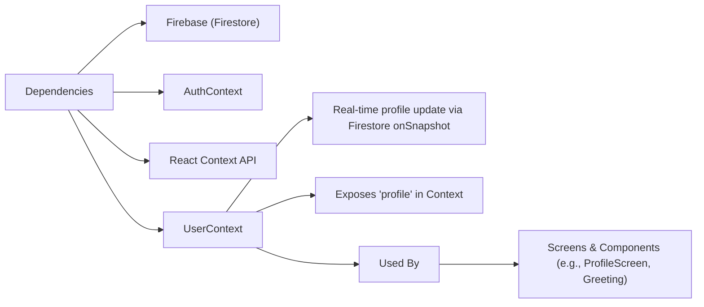

# User Management

## Overview
The User Management module provides a unified way to access and monitor user profile data throughout the application. It supplies up-to-date user information for any screen or component, ensuring that user-related features reflect the latest data from Firestore. This module is foundational for enabling personalized user experiences and secure access control.

## Key Features
- **Live Profile Syncing**: Automatically listens for real-time changes to the authenticated user's profile in Firestore and updates the app state.
- **Context-Based Access**: Exposes user profile data via React Context, making it easily consumable by any component in the component tree.
- **Seamless Integration with Auth**: Links profile data to the current authenticated user by leveraging the authentication context for user identification.

## System Errors
- **Missing User Document**: Profile listener may encounter missing user document in Firestore.
  - *Resolution*: Ensure a user profile is created in Firestore for every authenticated user.
- **Authentication Context Not Provided**: If used outside an AuthProvider, profile data will not be available.
  - *Resolution*: Wrap the component tree with both AuthProvider and UserProvider.
- **Firestore Permission Errors**: Insufficient permissions to read user profile data in Firestore.
  - *Resolution*: Configure Firestore security rules to allow read access for authenticated users on their profile document.

## Usage Examples
Practical code examples showing how to use the module:

```javascript
// Wrap your App component with both AuthProvider and UserProvider
import { AuthProvider } from './context/AuthContext';
import { UserProvider } from './context/UserContext';

export default function App() {
  return (
    <AuthProvider>
      <UserProvider>
        {/* ...rest of your application */}
      </UserProvider>
    </AuthProvider>
  );
}

// Access user profile data in any child component
import React from 'react';
import { useUser } from '../context/UserContext';

function Greeting() {
  const { profile } = useUser();
  return (
    <Text>
      Hello, {profile.displayName || 'Guest'}!
    </Text>
  );
}
```

## System Integration


