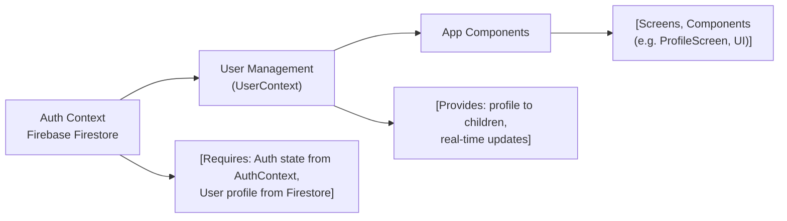

# User Management

## Overview
The User Management module provides user profile access and synchronization capabilities throughout the application. It centralizes user profile data, ensuring the authenticated user's information is consistently available across different app components. By leveraging real-time updates from Firebase Firestore, any changes to the user's profile are reflected in the app instantly, supporting a seamless and up-to-date user experience.

## Key Features
- **Centralized User Context**: Exposes a shared context containing the authenticated user's profile data, allowing any component to access user info without duplicating logic.
- **Real-Time Profile Synchronization**: Listens to changes in the user's Firestore profile and updates the app state immediately for all subscribers.
- **Seamless Integration With Authentication**: Automatically tracks the currently authenticated user and adjusts profile data accordingly when users log in, log out, or switch accounts.

## System Errors
- **Missing User Profile**: If the user's profile does not exist in Firestore, the context logs "No such user!" and the `profile` object stays empty. 
  - **Resolution**: Ensure a profile document exists in Firestore for every authenticated user.
- **Unauthenticated Access**: When no user is authenticated, the context does not provide any user profile data.
  - **Resolution**: Make sure the user is properly signed in before attempting to access user profile information.

## Usage Examples

```javascript
// App.js
import { UserProvider } from './context/UserContext';

export default function App() {
  return (
    <UserProvider>
      {/* ...rest of your app... */}
    </UserProvider>
  );
}

// In any component that needs user info:
import { useUser } from '../context/UserContext';

function Greeting() {
  const { profile } = useUser();
  return <Text>{`Hello, ${profile.displayName || "User"}!`}</Text>;
}
```

## System Integration


