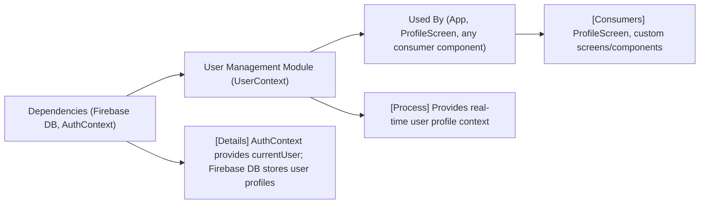

# User Management Module

## Overview
The User Management module centralizes user profile data and shares it across the application. It ensures that the authenticated user's profile information is always up-to-date by subscribing to real-time updates from the Firestore database. The module exposes a context that allows consumer components to access user-specific information without redundant requests or manual state management.

## Key Features
- **User Profile Context**: Provides a global context containing the currently authenticated user's profile details, ensuring consistent and easy access throughout the app.
- **Real-Time Sync**: Automatically syncs user profile data with Firestore, updating the context whenever the database changes.
- **Auth Integration**: Seamlessly integrates with the authentication system to fetch data for the correct user, handling profile updates when authentication state changes.

## System Errors
- **User Document Not Found**: If the user's profile document does not exist in the Firestore database, an error message ("No such user!") is logged to the console.  
  _Resolution_: Ensure users are properly registered, and their profile documents exist in the `users` collection.
- **Invalid Firebase Configuration**: If `FB_DB` is misconfigured or unavailable, profile fetching will fail silently.  
  _Resolution_: Validate Firebase initialization and verify connectivity.

## Usage Examples
Practical code examples showing how to use the module:

```javascript
// In your App.js or main entry point
import { UserProvider } from './context/UserContext';

export default function App() {
  return (
    <UserProvider>
      {/* other providers/components */}
      <ProfileScreen />
    </UserProvider>
  );
}

// Consuming user profile data inside a component
import React from 'react';
import { useUser } from '../context/UserContext';

function Greeting() {
  const { profile } = useUser();
  return <Text>Hello, {profile?.displayName || "User"}!</Text>;
}
```

## System Integration

