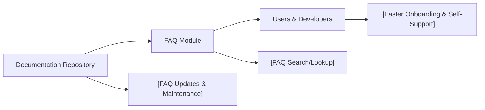

# FAQ Module

## Overview
The FAQ module provides a centralized location for storing and delivering answers to common questions about the Expo Firebase Boilerplate. Its purpose is to help users quickly resolve issues or learn about standard functionality without needing personal assistance, improving onboarding and reducing support overhead.

## Key Features
- **Centralized Knowledge Base**: Easily access frequently asked questions and their answers regarding the boilerplate setup, usage, and troubleshooting.
- **Quick Troubleshooting Resource**: Users can self-serve common fixes and workflow clarifications, reducing the need to contact maintainers.
- **Onboarding Support**: New users can accelerate their setup and learning process using curated FAQ content.

## System Errors
- **FAQ Not Found**: The requested FAQ entry does not exist.
  - **Resolution**: Check that the requested question matches an available entry. Update or add new FAQs if missing topics are identified.
- **Outdated Information**: An FAQ answer may not reflect the latest system changes.
  - **Resolution**: Regularly review and update FAQ content to ensure accuracy with the current codebase.

## Usage Examples

```markdown
## How do I start the project?
Clone the repository and run `npm install` followed by `expo start` to launch the development server.

## How do I connect Firebase?
Follow the instructions in the README to configure your Firebase credentials in the environment file.

## Where can I find troubleshooting steps for common Expo errors?
Check the 'Common Issues' section in this FAQ document for error-specific solutions and workarounds.
```

## System Integration


