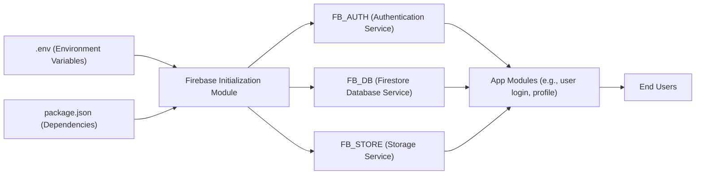

# Firebase Initialization Module

## Overview
This module centralizes the initialization and configuration of Firebase services within an Expo React Native project. It provides pre-configured instances for authentication, Firestore database, and cloud storage, allowing other parts of the application to access Firebase features seamlessly. The module ensures environment-based configuration, secure credential management, and persistent authentication state using React Native's AsyncStorage.

## Key Features

- **Centralized Firebase Initialization**:  
  Initializes Firebase app and its core services (Auth, Firestore, Storage) from a single location, using environmental variables for configuration.
- **Persistent Authentication**:  
  Sets up Firebase Authentication with persistent state management through AsyncStorage, ensuring users remain logged in between app sessions on mobile.
- **Secure Environment Configuration**:  
  Uses environment variables to inject sensitive keys and IDs, keeping secrets out of source code and enabling multi-environment (dev/prod) setups.
- **Simple Service Exports**:  
  Exposes pre-configured Firebase service instances (`FB_AUTH`, `FB_DB`, `FB_STORE`) for easy, consistent use across app modules.

## System Errors

- **Missing Environment Variables**:  
  If required `.env` keys (e.g., `APIKEY`, `PROJECTID`) are missing or misconfigured, the Firebase initialization may fail or behave unexpectedly.
  - *Resolution*: Verify your `.env` file is present and populated. Review variable names and make sure to reload or restart Metro bundler after changes.
- **AsyncStorage Errors**:  
  Issues with AsyncStorage (such as permissions or storage space) can prevent authentication state from persisting.
  - *Resolution*: Ensure device storage is available and permissions are granted. Check the logs for AsyncStorage errors.
- **Firebase SDK Errors**:  
  Invalid or expired API keys, incorrect project configuration, or network issues can result in authentication or data-access failures.
  - *Resolution*: Confirm all environment variables are for an active Firebase project and that your device has internet connectivity.

## Usage Examples

```js
// Import Firebase service instances from the module
import { FB_AUTH, FB_DB, FB_STORE } from './firebaseconfig';

// Example: Check if a user is authenticated
import { onAuthStateChanged } from "firebase/auth";
onAuthStateChanged(FB_AUTH, (user) => {
  if (user) {
    // User is signed in
  } else {
    // User is signed out
  }
});

// Example: Reading a document from Firestore
import { doc, getDoc } from "firebase/firestore";
const userRef = doc(FB_DB, "users", "someUserId");
const userSnap = await getDoc(userRef);

// Example: Uploading a file to Cloud Storage
import { ref, uploadBytes } from "firebase/storage";
const storageRef = ref(FB_STORE, 'images/profilePic.jpg');
await uploadBytes(storageRef, fileBlob);
```

## System Integration


