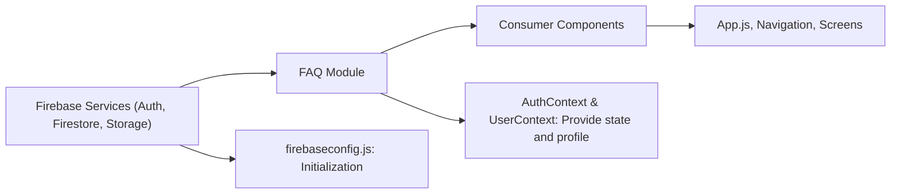

# FAQ Module

## Overview
The FAQ module is designed to clarify common questions and usage patterns relating to authentication and user management within the Expo Firebase Boilerplate. It helps developers understand how authentication states, user profiles, and Firebase services work together in the application architecture.

## Key Features
- **Authentication State Management**: Explains how user login status is tracked and used for navigation.
- **User Profile Synchronization**: Details how user data is kept up-to-date using Firestore and context.
- **Firebase Service Integration**: Clarifies how Firebase Auth, Firestore, and Storage are initialized and used in the app.
- **Context Providers**: Demonstrates the role of AuthProvider and UserProvider in sharing authentication and user data across components.

## System Errors
- **Invalid Credentials or Auth Failures**: Authentication functions may throw errors for incorrect email/password or network issues.  
  **Resolution**: Catch exceptions and display corresponding error messages to users. Check Firebase project and API configuration.
- **Missing User Document in Firestore**: During profile sync, if no user document exists in Firestore, the application will log "No such user!"  
  **Resolution**: Ensure users have a corresponding document in the "users" collection upon registration, or handle missing profiles gracefully.
- **Environment Variable Misconfiguration**: If Firebase config variables are missing or incorrectly set, initialization will fail.  
  **Resolution**: Verify `.env` values for all required Firebase keys before running the app.

## Usage Examples
Practical code examples showing how to use the authentication and user contexts:

```javascript
// How to sign in a user via AuthContext
import { useAuth } from './context/AuthContext';

const { signIn, currentUser, logOut } = useAuth();

async function handleLogin() {
  try {
    await signIn('user@example.com', 'password123');
    // User is now signed in; you can access currentUser
  } catch (error) {
    // Handle error: error.message
  }
}

// How to access user profile via UserContext
import { useUser } from './context/UserContext';

const { profile } = useUser();

// 'profile' will be automatically synced from Firestore when user is logged in
console.log(profile.displayName); // Access custom user properties

// How authentication state controls navigation
// AppNavigator automatically switches stacks based on currentUser
```

## System Integration


**Explanation:**  
- The FAQ module helps clarify the integration points between Firebase (initialized in `firebaseconfig.js`), the context providers (`AuthContext`, `UserContext`), and the rest of the app.
- `App.js` composes these providers and navigation stacks based on authentication state, making context values accessible throughout consumer components.
- Firestore and Auth errors are handled centrally, with user profiles synchronized dynamically.