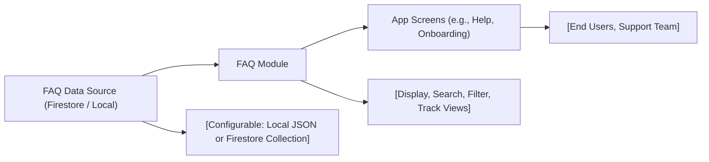

# FAQ Module

## Overview
The FAQ Module provides a centralized way to manage and display frequently asked questions within the Expo Firebase Boilerplate. Its main purpose is to help users find quick answers to common queries, reduce support requests, and improve onboarding efficiency.

## Key Features
- **Centralized FAQ Management**: Allows easy creation, organization, and updating of commonly asked questions and answers for the whole application.
- **User-Friendly Display**: Presents FAQs in a clear, accessible format integrated into the application's UI.
- **Search & Filter**: Enables users to search or filter questions for faster, relevant answers.
- **Configurable Data Source**: Supports dynamic FAQ content loading from local files or remote sources (like Firestore).

## System Errors
- **FAQ Data Unavailable**: Triggered when the FAQ content cannot be loaded (e.g., network failure, missing file).  
  **Resolution**: Ensure correct FAQ data source configuration and stable internet connection if pulling from remote.
- **Search/Filter Malfunction**: Occurs when user queries fail to return results or freeze the UI.  
  **Resolution**: Validate input handling and check for data integrity in the loaded FAQ dataset.

## Usage Examples

```javascript
// Displaying FAQs in a React Native component
import FAQSection from './components/FAQSection';

export default function HelpScreen() {
  return (
    <FAQSection
      source="remote" // Could be "local" or "remote" based on config
      onQuestionClick={question => console.log('User viewed:', question)}
    />
  );
}

// Searching FAQs
const results = faqModule.search('How to reset password');
// results: Array of FAQ entries matching the query
```

## System Integration

