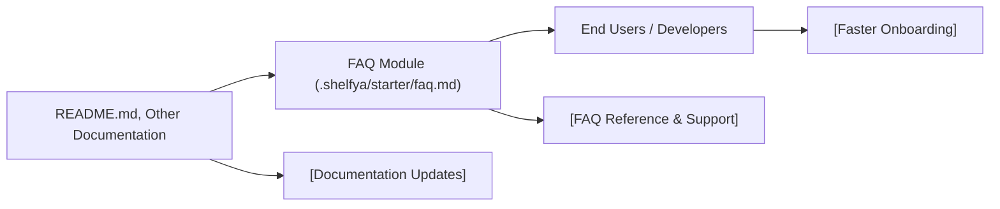

# FAQ Module

## Overview
The FAQ module provides centralized access to frequently asked questions within the starter application. It helps users and developers quickly find answers about using and integrating the Expo Firebase Boilerplate, reducing onboarding time and support requests.

## Key Features
- **Centralized FAQ Collection**: Aggregates essential questions and answers in one location for easy reference.
- **Starter Guidance**: Clarifies configuration, basic usage, and integration steps.
- **Support Reduction**: Minimizes the need for direct support by addressing common issues and scenarios upfront.

## System Errors
- **Outdated Information**: Some FAQ entries may not reflect recent code changes.  
  **Resolution**: Verify with the latest README and codebase updates.
- **Missing Answers**: Not all user queries are covered.  
  **Resolution**: Submit new questions for inclusion or check related documentation.

## Usage Examples

```markdown
# Accessing the FAQ

To view answers to common questions, open `.shelfya/starter/faq.md`.

# Example Entry
**Q:** How do I configure Firebase?  
**A:** Refer to the README setup section and follow the step-by-step guide.
```

## System Integration

