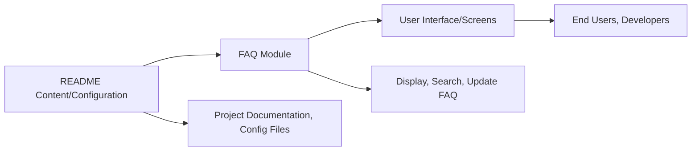

# FAQ Module

## Overview
The FAQ Module provides a structured way to display frequently asked questions and their answers within the Expo Firebase Boilerplate. It is designed to help users and developers quickly find solutions to common issues, making onboarding and troubleshooting more efficient.

## Key Features
- **Question-Answer Display**: Presents common questions and their respective answers in a readable format.
- **Searchable Content**: (If enabled) Allows users to search through FAQs for specific keywords or topics.
- **Easy Maintenance**: FAQs can be updated or extended without disrupting other system modules.

## System Errors
- **FAQ Not Found**: Occurs when a requested FAQ item does not exist.  
  Resolution: Double-check the FAQ identifier or update the FAQ data source.
- **Content Load Failure**: Happens if the FAQ data cannot be loaded (e.g., network issues or file corruption).  
  Resolution: Ensure network connectivity or verify the FAQ content/data file integrity.

## Usage Examples
```javascript
// Example: Import and use the FAQ module in your screen/component

import FAQ from './.shelfya/starter/faq';

// Render the FAQ section in your app
<FAQ
  questions={[
    { question: "How do I set up Firebase?", answer: "Follow the steps in the README." },
    { question: "Where do I find configuration files?", answer: "Refer to the config folder in the project root." }
  ]}
/>
```

## System Integration
