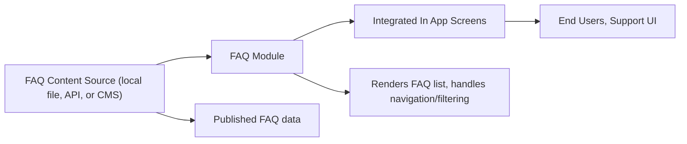

# FAQ Module

## Overview
The FAQ module provides end users with a list of frequently asked questions and their answers, serving as a self-service help and support resource within the application. It helps users quickly resolve common issues or understand how to use key features, reducing the need for direct support requests.

## Key Features
- **Display FAQ List**: Presents a curated list of common questions and their answers in an accessible format for users.
- **Interactive Categories**: Allows users to browse or filter FAQs by topic or category to quickly find relevant information.
- **In-App Integration**: Embeds directly within the main application user interface, ensuring a seamless support experience.
- **Support Contact Guidance**: Directs users to contact support when their issue is not covered in the FAQ.

## System Errors
- **Content Not Available**: FAQ data fails to load (e.g., network issues or backend errors).  
  _Resolution_: Ensure device connectivity and backend availability; provide fallback messaging to inform users.
- **Outdated Information**: Displayed FAQ entries may not reflect current app features or policies.  
  _Resolution_: Schedule regular content reviews and updates to ensure accuracy.

## Usage Examples

```jsx
// Example: Rendering the FAQ module within a screen
import FAQ from './components/FAQ';

export default function HelpScreen() {
  return (
    <View>
      <FAQ />
    </View>
  );
}

// Example: Navigating to the FAQ from a Help button
import { useNavigation } from '@react-navigation/native';

const HelpButton = () => {
  const navigation = useNavigation();
  return (
    <Button title="FAQ" onPress={() => navigation.navigate('FAQScreen')} />
  );
};
```

## System Integration


