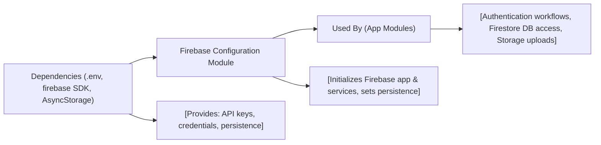

# Firebase Configuration Module

## Overview
The Firebase Configuration Module centralizes the initialization and export of Firebase services (Authentication, Firestore, Storage) for use throughout the Expo React Native application. It ensures seamless integration of Firebase's core features, with environment-based configuration and support for persistent authentication via AsyncStorage.

## Key Features
- **Centralized Service Initialization**: Initializes Firebase app and its main services—authentication, Firestore database, and storage—from a single configuration point.
- **Environment-Driven Configuration**: Loads required credentials and connection information using environment variables for secure and flexible deployment.
- **Persistent Authentication**: Implements React Native AsyncStorage as the persistence mechanism for user authentication state, enabling session continuity across app launches.
- **Public Service Exports**: Provides direct access to the initialized Firebase services (app, auth, db, storage) for feature modules within the application.

## System Errors
- **Missing Environment Variables**: If required variables (e.g., APIKEY, PROJECTID) are missing, Firebase initialization will fail, causing runtime errors.
  - **Resolution**: Ensure `.env` file contains all necessary credentials matching `.env.exemple`.
- **Invalid Credentials**: Incorrect or invalid credentials may prevent connection to Firebase services.
  - **Resolution**: Confirm values in the `.env` file correspond to your Firebase project settings.
- **AsyncStorage Errors**: Issues with device storage can affect authentication persistence.
  - **Resolution**: Check device storage permissions and integrity; review error logs for AsyncStorage operations.

## Usage Examples
Practical code examples showing how to use the module:

```javascript
import { FB_AUTH, FB_DB, FB_STORE } from './firebaseconfig';

// Example: Sign in a user with Firebase Auth
import { signInWithEmailAndPassword } from 'firebase/auth';

signInWithEmailAndPassword(FB_AUTH, 'user@example.com', 'password123')
  .then(userCredential => {
    // Signed in
    const user = userCredential.user;
    // proceed with app logic
  })
  .catch(error => {
    // Handle authentication errors
  });

// Example: Add data to Firestore
import { collection, addDoc } from 'firebase/firestore';

addDoc(collection(FB_DB, 'users'), { name: 'John Doe', email: 'john@example.com' })
  .then(docRef => {
    // Document added with ID: docRef.id
  })
  .catch(error => {
    // Handle Firestore error
  });

// Example: Upload a file to Firebase Storage
import { ref, uploadBytes } from 'firebase/storage';

const storageRef = ref(FB_STORE, 'avatars/user123.jpg');
uploadBytes(storageRef, fileBlob)
  .then(snapshot => {
    // File uploaded successfully
  })
  .catch(error => {
    // Handle upload error
  });
```

## System Integration

