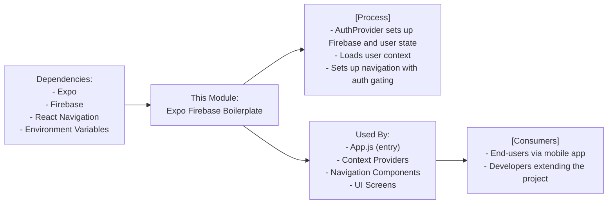

# Getting Started with Expo Firebase Boilerplate

## Overview
This starter project provides a boilerplate for building React Native mobile applications using Expo and Firebase. It focuses on rapid onboarding for cross-platform development and streamlines essential components such as authentication, navigation, and user context management. Integrating Firebase enables robust authentication and backend connectivity out of the box, while following best practices for configuration, environment management, and component structuring.

## Key Features
- **Expo Managed Workflow**: Simplifies cross-platform mobile app development and deployment.
- **Firebase Integration**: Enables authentication, data storage, and backend services using environment-driven configuration.
- **Authentication Flow**: Seamlessly switches between authentication screens and main application content based on user login state.
- **Modular Navigation**: Employs React Navigation (Stack and Tab) for scalable screen management.
- **Environment Variable Support**: Simplified, secure configuration with `.env` integration for Firebase and other secrets.
- **Customizable User Context**: Built-in context providers for authenticated user and related user data.
- **SVG and Asset Support**: Metro and Babel configurations support importing SVG assets and other static resources.
- **Ready for Extensibility**: Easily add new features or integrations following the project's modular structure.

## System Errors
- **Missing/Invalid Environment Variables**: Failure to provide required Firebase keys in `.env` will cause app initialization errors or runtime failures.  
  _Resolution_: Copy `.env.exemple` to `.env`, fill in your Firebase project details (APIKEY, PROJECTID, etc.), and restart the development server.
- **Incorrect Firebase Configuration**: If the Firebase project details do not match your actual project, authentication and backend calls will fail.  
  _Resolution_: Verify correctness with your Firebase console.
- **Metro or Babel Loading Errors (SVG/Assets)**: If assets such as SVGs fail to load, ensure you have the correct transformer packages and configuration in `babel.config.js` and `metro.config.js`.  
  _Resolution_: Follow the current configurations in this starter, and when upgrading dependencies, ensure these files are adapted as well.
- **Dependency Not Installed**: Errors such as "module not found" typically mean a required package wasn't installed.  
  _Resolution_: Run `npm install` or `yarn install` to fetch all dependencies as specified in `package.json`.

## Usage Examples

```js
// .env (create in the root folder, fill with your Firebase config)
APIKEY=yourApiKey
PROJECTID=yourProjectId
AUTHDOMAIN=yourAuthDomain
STORAGEBUCKET=yourStorageBucket
MESSAGINGSENDERID=yourMessagingSenderId
APPID=yourAppId
```

```bash
# Basic workflow
npm install               # Install dependencies
cp .env.exemple .env      # Copy env example and fill with your config
npm run start             # Launch Expo app
```

```js
// App.js (Core entrypoint, nothing to change for basic usage)
import React from 'react';
import { NavigationContainer } from '@react-navigation/native';
import { AuthProvider } from './context/AuthContext';
import { UserProvider } from './context/UserContext';
import AppNavigator from './path/to/AppNavigator';

export default function App() {
  return (
    <AuthProvider>
      <UserProvider>
        <NavigationContainer>
          <AppNavigator />
        </NavigationContainer>
      </UserProvider>
    </AuthProvider>
  );
}
```

## System Integration



This structure ensures you can immediately start customizing or extending your Expo + Firebase project, with authentication and navigation ready for scale. For details on adding new features, refer to the main README or related documentation.