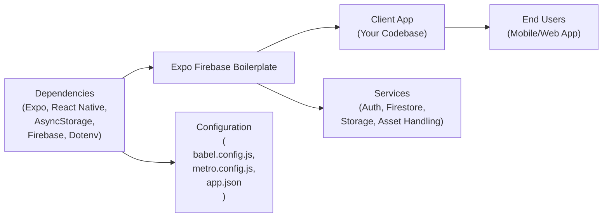

# Getting Started with Expo Firebase Boilerplate

## Overview
This starter project provides a ready-to-use integration between Expo, React Native, and Firebase services. It offers a foundational architecture for rapid app development, allowing you to easily leverage user authentication, cloud storage, and a scalable NoSQL database. It streamlines configuration for development and production environments and is suitable for cross-platform deployment (iOS, Android, Web).

## Key Features
- **Expo & React Native Scaffold**: Includes all the necessary configuration files for bootstrapping your mobile app with Expo and React Native, supporting hot-reloading and platform-specific builds.
- **Firebase Integration**: Seamlessly connects to Firebase for authentication, Firestore database, and cloud storage, using environment variables for security and flexibility.
- **Auth Persistence with AsyncStorage**: Enables persistent sign-in state across app sessions by storing authentication data securely.
- **SVG Asset Support**: Enhanced asset pipeline for SVG graphics, enabling easy usage of scalable vector images within your app.
- **Environment Variable Management**: Uses react-native-dotenv for managing secrets and configuration, allowing for different setups (e.g., staging, production) without code changes.
- **Unified Configuration**: Includes Babel, Metro, and Expo configurations pre-set for common use cases (asset handling, transpilation, platform adaptation).

## System Errors
- **Missing/Invalid Environment Variables**:  
  *Description*: Firebase initialization uses environment variables from your .env file. If any key is missing or invalid, app features relying on Firebase may fail.  
  *Resolution*: Double-check your .env file for required variables (APIKEY, AUTHDOMAIN, PROJECTID, etc.) and their values.

- **Asset or SVG Loading Errors**:  
  *Description*: Asset pipeline misconfigurations may prevent static assets or SVG files from loading properly.  
  *Resolution*: Ensure asset paths are correct, verify metro.config.js is properly handling assetExts/sourceExts, and check your assets folder for missing or corrupt files.

## Usage Examples

```javascript
// Import Firebase services from the boilerplate
import { FB_AUTH, FB_DB, FB_STORE } from './firebaseconfig';

// Example: Create a new Firestore Document
import { collection, addDoc } from "firebase/firestore";
async function addChallenge(data) {
  await addDoc(collection(FB_DB, "challenges"), data);
}

// Example: Authenticate user with Email & Password
import { signInWithEmailAndPassword } from "firebase/auth";
async function login(email, password) {
  const userCredential = await signInWithEmailAndPassword(FB_AUTH, email, password);
  // Access user via userCredential.user
}

// Example: Upload file to Firebase Storage
import { ref, uploadBytes } from "firebase/storage";
async function uploadImage(fileUri) {
  const fileRef = ref(FB_STORE, 'images/' + Date.now());
  await uploadBytes(fileRef, fileUri);
}
```

## System Integration


