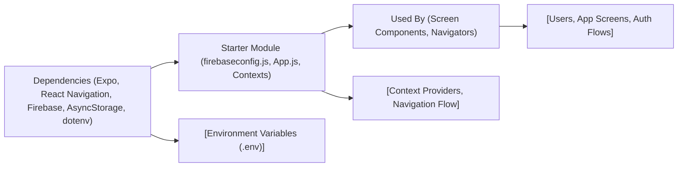

# Getting Started with Expo Firebase Boilerplate

## Overview
This boilerplate provides a ready-to-use integration between an Expo React Native application and Firebase backend services (Authentication, Firestore, Storage). It is designed to streamline the development process for mobile apps requiring user authentication, real-time data storage, and cloud asset management. The starter uses React Navigation for page flow and context providers for managing authentication and user state.

## Key Features
- **Firebase Initialization**: Seamless setup and configuration of Firebase services (Auth, Firestore, Storage) with environment variable support for credentials.
- **Authentication Flow**: Out-of-the-box user authentication UI stack and protected routes, managed via React Context.
- **User State Management**: Application-wide accessibility of user data using React Context.
- **Navigation Structure**: Automatic route switching between authentication and main app screens based on user's login status.
- **Expo Integration**: Compatible with Expo for rapid development and testing across platforms.

## System Errors
- **Missing Environment Variables**:  
  **Description**: If required Firebase credentials are not set in your environment files, initialization will fail.  
  **Resolution**: Ensure `.env` contains all needed keys (APIKEY, AUTHDOMAIN, PROJECTID, STORAGEBUCKET, MESSAGINGSENDERID, APPID).
- **Firebase Initialization Error**:  
  **Description**: Errors during Firebase setup, usually due to incorrect configuration.  
  **Resolution**: Double-check your environment variable values and internet connection.
- **AsyncStorage Persistence Error**:  
  **Description**: Authentication state may not persist if AsyncStorage is not properly linked.  
  **Resolution**: Confirm that `@react-native-async-storage/async-storage` is installed and correctly configured.
- **Navigation Errors**:  
  **Description**: Broken navigation flow if stack components or providers are missing.  
  **Resolution**: Verify that all context providers (`AuthProvider`, `UserProvider`) wrap the `NavigationContainer`.

## Usage Examples

```javascript
// In your firebaseconfig.js
import { FB_AUTH, FB_DB } from './firebaseconfig';
// Use FB_AUTH for authentication methods
// Use FB_DB for accessing Firestore

// In your App.js (already set up)
export default function App() {
  return (
    <AuthProvider>
      <UserProvider>
        <NavigationContainer>
          <AppNavigator />
        </NavigationContainer>
      </UserProvider>
    </AuthProvider>
  );
}

// Example of accessing Firebase Auth
import { FB_AUTH } from './firebaseconfig';
import { signInWithEmailAndPassword } from "firebase/auth";
signInWithEmailAndPassword(FB_AUTH, email, password);

// Example of using Firestore
import { FB_DB } from './firebaseconfig';
import { collection, getDocs } from "firebase/firestore";
const usersCol = collection(FB_DB, "users");
const usersList = await getDocs(usersCol);
```

## System Integration


