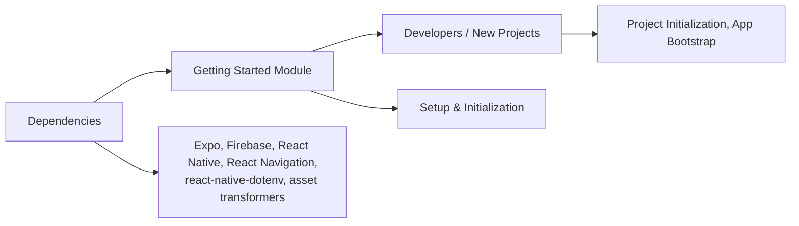

# Getting Started Module

## Overview
The Getting Started module provides the foundational setup steps and configuration guidance required to launch and develop applications using the Expo Firebase Boilerplate. Its purpose is to help developers quickly initialize their project environment, understand project structure, and integrate essential dependencies, enabling a streamlined start for cross-platform React Native projects with Firebase backend integration.

## Key Features
- **Project Initialization Guidance**: Outlines how to install dependencies, configure environment files, and start the application on various platforms (Android, iOS, web).
- **Cross-Platform Expo Support**: Delivers a consistent experience for running and debugging the app across Android, iOS, and web using Expo's unified tooling.
- **Firebase Integration Setup**: Guides developers through connecting the application to Firebase using the appropriate SDK and configuration.
- **Navigation Setup Assistance**: Introduces routing structure provided by React Navigation for multi-screen workflows.
- **Environment Variable Loading**: Ensures sensitive settings (API keys, endpoints) are managed securely using dotenv and react-native-dotenv.

## System Errors
- **Dependency Version Mismatch**: If package versions in `package.json` are not compatible with each other or with Expo, installation or runtime errors may occur.
  - *Resolution*: Use versions specified in the boilerplate; run `npm install` or `yarn` after cloning, and do not upgrade dependencies arbitrarily.
- **Missing Environment Variables**: If required variables are absent from `.env`, the app may fail to start or connect to services.
  - *Resolution*: Ensure `.env` is created based on provided samples and necessary values are set.
- **Metro Bundler SVG Error**: If SVG support is misconfigured, images may fail to load.
  - *Resolution*: The `metro.config.js` must use `react-native-svg-transformer` and include correct file extensions (per sample).
- **Expo Not Installed Globally**: If you receive the error “expo: command not found,” you cannot run the app locally.
  - *Resolution*: Install Expo CLI globally with `npm install -g expo-cli`.

## Usage Examples
Practical steps to get started:

```bash
# 1. Clone the repository
git clone https://github.com/lucasboucher/Expo-Firebase-Boiler-Plate-2.git
cd Expo-Firebase-Boiler-Plate-2

# 2. Install dependencies
npm install    # or: yarn

# 3. Create a .env file for environment variables (API keys, etc.)
cp .env.example .env
# Edit .env and add your Firebase and other keys

# 4. Start the Metro bundler and launch app on your target platform:
npm run android   # Start on Android emulator/device
npm run ios       # Start on iOS simulator/device
npm run web       # Start in web browser

# 5. (Optional) Run Expo developer tools:
npm start
```

## System Integration

