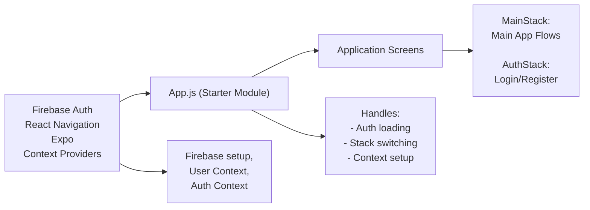

# Getting Started

## Overview
This starter module provides a foundation for developing React Native apps using Expo with integrated Firebase authentication and navigation. It establishes the main application structure, manages authentication state, and provides a ready environment for building scalable, feature-rich mobile apps.

## Key Features
- **Dual Stack Navigation**: Automatically switches between authentication flow and main app flow based on user login state, leveraging React Navigation's stack navigator.
- **Firebase Authentication Integration**: Centralized authentication state management using context providers to track the current user and loading state.
- **Global State Management**: Provides access to authenticated user data across the application via context providers, enabling seamless data sharing.
- **Expo Compatibility**: Optimized for Expo, allowing rapid development and easy deployment on Android, iOS, and web platforms.

## System Errors
- **Authentication Loading Delay**: If the authentication state takes too long to resolve, users may see a persistent loading spinner.
  - **Resolution**: Ensure Firebase is correctly configured and that your network connection is stable. Review async loading logic and environment setup.
- **Navigation Mismatch**: If navigation routes are not properly set in `MainStack` or `AuthStack`, users may experience navigation errors or missing screens.
  - **Resolution**: Verify that both `MainStack` and `AuthStack` are correctly exported and contain the expected screens.

## Usage Examples

```javascript
// Entry point: App.js

import React from 'react';
import App from './App'; // Main app structure provided by the starter

export default App;

// Typical usage scenario:
// 1. Wrap your app in AuthProvider and UserProvider (for auth and user state).
// 2. NavigationContainer manages navigation context.
// 3. AppNavigator conditionally renders MainStack or AuthStack depending on Firebase authentication state.
```

## System Integration


