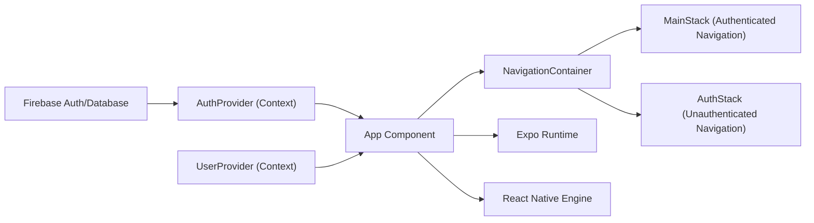

# Getting Started

## Overview
This project is a boilerplate for building mobile apps using Expo, React Native, Firebase, and React Navigation. It provides a ready-to-use authentication flow and basic user management out of the box, serving as a foundation for building scalable and secure mobile applications.

## Key Features
- **Expo-Based Workflow**: Leverages Expo for simplified development, deployment, and testing on iOS, Android, and web platforms.
- **Firebase Authentication Integration**: Provides user authentication functionality with Firebase, managing login, logout, and session states.
- **React Navigation Setup**: Implements a dual-stack navigation model, automatically routing users between authentication screens and main app features based on their sign-in state.
- **Context-Based State Management**: Uses React Context (`AuthProvider`, `UserProvider`) to manage authentication and user data globally across the application.
- **User Experience Defaults**: Displays loading state during authentication checks and shows appropriate screens based on sign-in status.

## System Errors
It's important to document common errors and troubleshooting specify :
- **Firebase Configuration Error**: If Firebase is not correctly configured via environment variables or Firebase console, authentication will fail.  
  **Resolution**: Ensure your Firebase credentials are added to the project and the Firebase setup matches your app configuration.
- **Navigation Error**: Missing or incorrect navigation stack configuration may result in blank screens or navigation failures.  
  **Resolution**: Ensure all navigators (`MainStack`, `AuthStack`) and their screens are correctly registered and exported.
- **Environment Variable Error**: Problems loading environment variables via `.env` can prevent Firebase and other integrations from working.  
  **Resolution**: Ensure the `.env` file is present, environment variable names match, and Babel config for `react-native-dotenv` is properly set.

## Usage Examples

```javascript
// Start the development server
npm install
npm run start

// App.js usage pattern
import React from 'react';
import { AuthProvider, useAuth } from './context/AuthContext';
import { UserProvider } from './context/UserContext';
import { NavigationContainer } from '@react-navigation/native';
// ...rest of import/setup

export default function App() {
  return (
    <AuthProvider>
      <UserProvider>
        <NavigationContainer>
          {/* App navigation logic */}
        </NavigationContainer>
      </UserProvider>
    </AuthProvider>
  );
}
```

```bash
# Start on Android emulator
npm run android

# Start on iOS simulator
npm run ios

# Start on the web
npm run web
```

## System Integration


*Dependencies:*  
- Firebase services (authentication, database)  
- Expo SDK & React Native libraries  
- Environment variables for configuration

*Used By:*  
- Developers customizing authentication and navigation  
- Any React Native/Expo app using this boilerplate for rapid project scaffolding