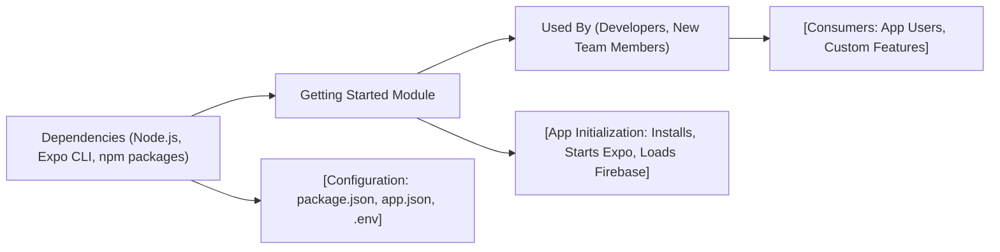

# Getting Started

## Overview
The "Getting Started" module guides developers through launching and configuring the Expo Firebase boilerplate app. Its purpose is to ensure that new users can easily set up, run, and begin customizing the mobile application leveraging Expo, React Native, and Firebase.

## Key Features
- **Environment Setup Guidance**: Provides instructions for installing dependencies and tools required for development.
- **Quick App Launch**: Explains how to start the app across multiple platforms (iOS, Android, Web) using Expo scripts.
- **Boilerplate Structure Overview**: Introduces the main structural components (Expo, React Native, Firebase), helping users understand key integration points.
- **Configuration Reference**: Points to core configuration files (e.g., `package.json`, `app.json`) for customizing behavior and metadata.

## System Errors
It's important to document common errors and troubleshooting specify :
- **Dependency Installation Error**: Occurs if required packages are missing or out of date.  
  *Resolution*: Run `npm install` or `yarn install` to update dependencies.
- **Expo Not Installed**: Error when expo CLI is not globally available.  
  *Resolution*: Install Expo CLI with `npm install -g expo-cli`.
- **Platform Build Failure**: Sometimes platform-specific requirements (like Android SDK or Xcode for iOS) are missing.  
  *Resolution*: Follow Expo's platform-specific setup guides to install necessary tooling.
- **Environment Variables Misconfigured**: Issues integrating Firebase or API keys due to missing `.env` values.  
  *Resolution*: Ensure `.env` file is present and correctly formatted according to documentation.

## Usage Examples
Practical code examples showing how to use the module:

```bash
# 1. Install dependencies
npm install

# 2. Start development server (Metro bundler)
npm start

# 3. Run on Android device/emulator
npm run android

# 4. Run on iOS simulator
npm run ios

# 5. Run as web app in browser
npm run web
```

## System Integration
Complete the Mermaid diagram showing how this module integrates with the system:

