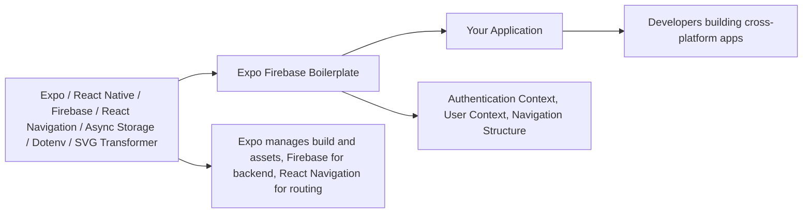

# Getting Started with Expo Firebase Boilerplate

## Overview
This module provides a robust starting point for building cross-platform mobile applications using Expo, React Native, and Firebase. The boilerplate includes pre-configured navigation, authentication flows, and basic project structure, allowing developers to fast-track the setup phase and focus on building their app's features.

## Key Features
- **Expo Integration**: Rapid development and building for iOS, Android, and web using the managed Expo workflow.
- **Firebase Ready**: Prepares the foundation for integrating Firebase services (authentication, realtime database, etc.).
- **Navigation Structure**: Built-in React Navigation with main stack and authentication stack separation, supporting authenticated and guest flows.
- **Context Providers**: Global Auth and User context providers for clean state and user management across the app.
- **Custom Metro & Babel Config**: Enhanced configuration for SVG support and use of environment variables in development and production.

## System Errors
It's important to document common errors and troubleshooting:

- **Missing Environment Variables**:  
  _Description_: If required variables (like Firebase config) are not set in the `.env` file, authentication or backend features may fail.  
  _Resolution_: Ensure all necessary variables are present in your `.env` file and imported using `react-native-dotenv`.
  
- **Dependency Compatibility Issues**:  
  _Description_: Errors related to incompatible versions (e.g., React Native, Expo, or navigation libraries).  
  _Resolution_: Run `npm install` or `yarn install` to make sure dependencies match the versions specified in `package.json`.

- **SVG Import Errors**:  
  _Description_: Importing `.svg` files fails due to misconfiguration in Metro bundler.  
  _Resolution_: Confirm that `metro.config.js` and required transformer packages are properly set up.

## Usage Examples

```javascript
// 1. Install dependencies
// $ npm install

// 2. Run the app on devices/emulators
// $ npm run android   # for Android
// $ npm run ios       # for iOS
// $ npm run web       # for Web

// 3. Structure of App.js
import React from 'react';
import { NavigationContainer } from '@react-navigation/native';
import { AuthProvider } from './context/AuthContext';
import { UserProvider } from './context/UserContext';
import AppNavigator from './path/to/NavigatorComponent'; // Manages auth and main stacks

export default function App() {
  return (
    <AuthProvider>
      <UserProvider>
        <NavigationContainer>
          <AppNavigator />
        </NavigationContainer>
      </UserProvider>
    </AuthProvider>
  );
}
```

## System Integration


